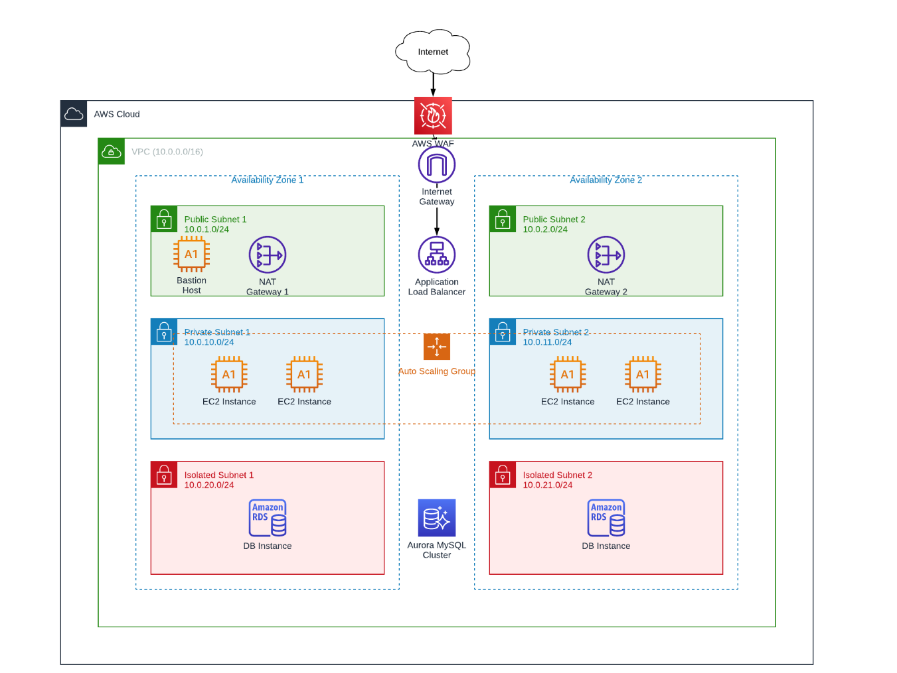

# Terraform 3-Tier Architecture on AWS

AWS 클라우드에서 고가용성 3계층 아키텍처를 Terraform으로 구축하는 IaC 프로젝트입니다.

## 🏗️ Architecture



## 📋 Overview

| Tier | Components | Subnet |
|------|------------|--------|
| **Web/Public** | Bastion Host, NAT Gateway, ALB | Public Subnet (10.0.1.0/24, 10.0.2.0/24) |
| **Application** | EC2 Auto Scaling Group | Private Subnet (10.0.10.0/24, 10.0.11.0/24) |
| **Data** | Aurora MySQL / RDS | Isolated Subnet (10.0.20.0/24, 10.0.21.0/24) |

## 🌐 Network Configuration

- **VPC CIDR**: `10.0.0.0/16`
- **Availability Zones**: 2개 (고가용성)
- **NAT Gateway**: 각 AZ에 1개씩 (총 2개)
- **Internet Gateway**: 1개
- **AWS WAF**: ALB 보호

### Subnet Layout

| Subnet Type | AZ 1 | AZ 2 |
|-------------|------|------|
| Public | 10.0.1.0/24 | 10.0.2.0/24 |
| Private (App) | 10.0.10.0/24 | 10.0.11.0/24 |
| Isolated (Data) | 10.0.20.0/24 | 10.0.21.0/24 |

## 📁 Project Structure

```
.
├── backend/                 # Terraform backend (S3 + DynamoDB)
│   ├── dynamodb.tf
│   ├── provider.tf
│   └── s3.tf
├── dev/                     # Development environment
│   ├── backend.tf
│   ├── main.tf
│   ├── provider.tf
│   ├── variable.tf
│   └── script/
│       └── install_apache.sh
├── staging/                 # Staging environment
│   ├── backend.tf
│   ├── main.tf
│   ├── provider.tf
│   └── variable.tf
├── module/
│   ├── network/             # VPC, Subnet, NAT, IGW, Route Tables
│   ├── application/         # EC2, ALB, Auto Scaling
│   ├── container/           # ECS, ECR (staging용)
│   └── data/                # RDS, Subnet Group
└── docs/
    └── architecture.png     # Architecture diagram
```

## 🚀 Getting Started

### Prerequisites

- [Terraform](https://www.terraform.io/downloads) >= 1.0
- AWS CLI configured
- AWS Account with appropriate permissions

### Deployment

1. **Backend 초기화** (최초 1회)
   ```bash
   cd backend
   terraform init
   terraform apply
   ```

2. **환경 배포**
   ```bash
   # Development
   cd dev
   terraform init
   terraform plan
   terraform apply

   # Staging
   cd staging
   terraform init
   terraform plan
   terraform apply
   ```

### Variables

| Variable | Description | Default |
|----------|-------------|---------|
| `environment` | Environment name (dev/staging) | - |
| `database_password` | RDS master password | - |

## 🔒 Security

- **Bastion Host**: Public Subnet에 위치, SSH 접근 제어
- **Application EC2**: Private Subnet에 위치, Bastion을 통해서만 SSH 접근
- **RDS**: Isolated Subnet에 위치, Application 계층에서만 접근 가능
- **ALB**: AWS WAF로 보호, HTTPS 지원

## 📝 License

This project is licensed under the MIT License.
