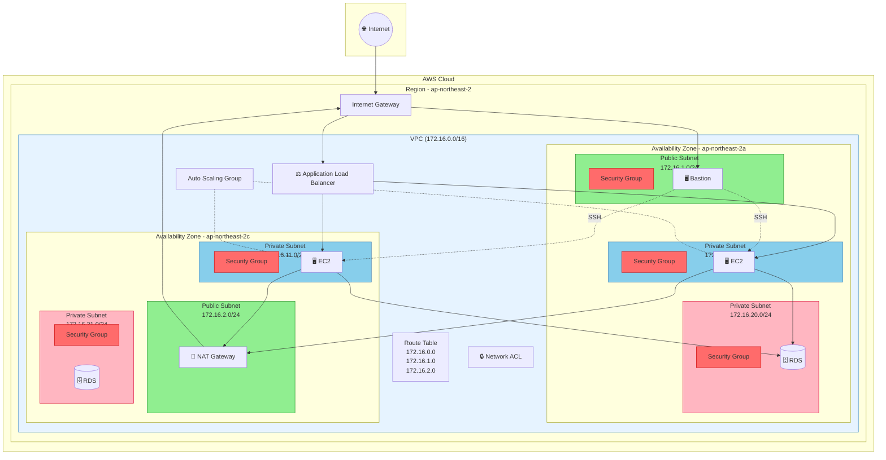

# Terraform 3-Tier Architecture on AWS

AWS 클라우드에서 고가용성 3계층 아키텍처를 Terraform으로 구축하는 IaC 프로젝트입니다.

## 🏗️ Architecture



## 📋 Overview

| Tier | Components | Subnet |
|------|------------|--------|
| **Web/Public** | Bastion Host, NAT Gateway, ALB | Public Subnet (172.16.1.0/24, 172.16.2.0/24) |
| **Application** | EC2 Auto Scaling Group | Private Subnet (172.16.10.0/24, 172.16.11.0/24) |
| **Data** | RDS MySQL | Private Subnet (172.16.20.0/24, 172.16.21.0/24) |

## 🌐 Network Configuration

- **VPC CIDR**: `172.16.0.0/16`
- **Availability Zones**: 2개 (ap-northeast-2a, ap-northeast-2c)
- **NAT Gateway**: 1개 (Public Subnet 2)
- **Internet Gateway**: 1개
- **Network ACL**: Private Subnet 보호

### Subnet Layout

| Subnet Type | AZ 1 (ap-northeast-2a) | AZ 2 (ap-northeast-2c) |
|-------------|------------------------|------------------------|
| Public | 172.16.1.0/24 | 172.16.2.0/24 |
| Private (App) | 172.16.10.0/24 | 172.16.11.0/24 |
| Private (Data) | 172.16.20.0/24 | 172.16.21.0/24 |

## 📁 Project Structure

```
.
├── backend/                 # Terraform backend (S3 + DynamoDB)
│   ├── dynamodb.tf
│   ├── provider.tf
│   └── s3.tf
├── dev/                     # Development environment
│   ├── backend.tf
│   ├── main.tf
│   ├── provider.tf
│   ├── variable.tf
│   └── script/
│       └── install_apach.sh
├── staging/                 # Staging environment
│   ├── backend.tf
│   ├── main.tf
│   ├── provider.tf
│   └── variable.tf
├── module/
│   ├── network/             # VPC, Subnet, NAT, IGW, Route Tables, NACL
│   ├── application/         # EC2, ALB, Auto Scaling
│   ├── container/           # ECS, ECR (staging용)
│   └── data/                # RDS, Subnet Group
└── docs/                    # Documentation
```

## 🚀 Getting Started

### Prerequisites

- [Terraform](https://www.terraform.io/downloads) >= 1.0
- AWS CLI configured
- AWS Account with appropriate permissions

### Deployment

1. **Backend 초기화** (최초 1회)
   ```bash
   cd backend
   terraform init
   terraform apply
   ```

2. **환경 배포**
   ```bash
   # Development
   cd dev
   terraform init
   terraform plan
   terraform apply

   # Staging
   cd staging
   terraform init
   terraform plan
   terraform apply
   ```

### Variables

| Variable | Description | Default |
|----------|-------------|---------|
| `environment` | Environment name (dev/staging) | - |
| `database_password` | RDS master password | - |

## 🔒 Security

- **Bastion Host**: Public Subnet에 위치, SSH 접근 제어
- **Application EC2**: Private Subnet에 위치, Bastion을 통해서만 SSH 접근
- **RDS**: Isolated Subnet에 위치, Application 계층에서만 접근 가능
- **ALB**: AWS WAF로 보호, HTTPS 지원

## � References

- [Building a Secure and Scalable Three-Tier Architecture on AWS using CloudFormation](https://repost.aws/articles/ARGpERJ3jISbOAlnmfVUsvMQ/building-a-secure-and-scalable-three-tier-architecture-on-aws-using-cloudformation) - AWS Community
- [Terraform-3-Tier-Architecture](https://github.com/yaini/Terraform-3-Tier-Architecture) - yaini

## �📝 License

This project is licensed under the MIT License.
